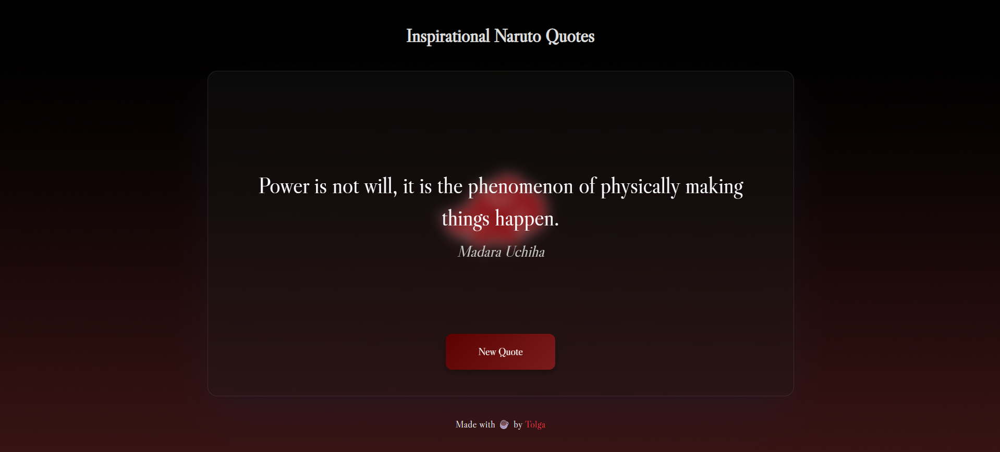

# Naruto Quote Generator

_[English](README.md) | Türkçe_

Naruto anime serisinden motivasyonel sözleri gösteren basit web uygulaması.

## Önizleme

## Canlı Önizleme

Projeyi doğrudan buradan deneyebilirsiniz:  
👉 [Naruto Quote Generator - Canlı Önizleme](https://tolgab35.github.io/naruto-quote-generator/)

## Özellikler

- Rastgele söz gösterimi
- Temiz ve minimal tasarım
- Vanilla JavaScript kullanımı
- JSON dosyasından veri yükleme
- Ardışık aynı sözün gösterilmesini engelleme

## Teknolojiler

- HTML5
- CSS3
- Vanilla JavaScript

## Kullanım

1. `index.html` dosyasını tarayıcıda açın
2. "New Quote" butonuna tıklayarak yeni sözler görebilirsiniz

## Dosya Yapısı

- `index.html` - Ana HTML dosyası
- `script.js` - JavaScript kodları
- `style.css` - CSS stilleri
- `quotes.json` - Anime sözleri veri dosyası

## Katkıda Bulunma

Projeye katkıda bulunmak istiyorsanız:

1. Bu repository'yi fork edin
2. Yeni bir branch oluşturun (`git checkout -b feature/yeni-ozellik`)
3. Değişikliklerinizi commit edin (`git commit -am 'Yeni özellik eklendi'`)
4. Branch'inizi push edin (`git push origin feature/yeni-ozellik`)
5. Pull Request oluşturun

### Katkı Fikirleri

- Yeni sözler eklemek
- Görsel tasarımı geliştirmek
- Yeni özellikler eklemek (tema değiştirme, favoriler, vb.)
- Kod optimizasyonu yapmak
- Çoklu dil desteği eklemek

## Lisans

Bu proje MIT lisansı altında lisanslanmıştır. Detaylar için [LICENSE](LICENSE) dosyasına bakınız.
